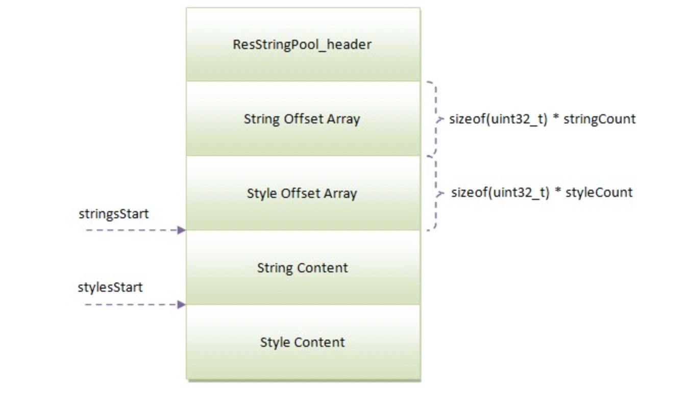
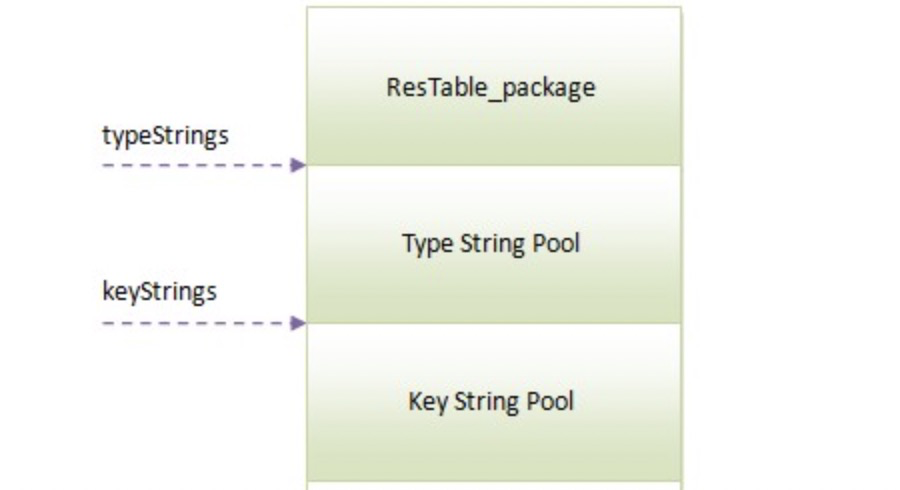

原文地址：https://blog.csdn.net/weixin_36570478/article/details/108929934

## resource.arsc格式解析

## 一、文件头部ResTable_header


```cpp
struct ResTable_header
{
    struct ResChunk_header header;

    // The number of ResTable_package structures.
    uint32_t packageCount;
};

```

- header : ResChunk_header类型，其中type为RES_TABLE_TYPE
- packageCount : arsc文件中ResTablePackage的个数，通常是 1。

### 1.1 Chunk头结构

```cpp
struct ResChunk_header
{
	
    // Type identifier for this chunk.  The meaning of this value depends
    // on the containing chunk.
    uint16_t type;

    // Size of the chunk header (in bytes).  Adding this value to
    // the address of the chunk allows you to find its associated data
    // (if any).
    uint16_t headerSize;

    // Total size of this chunk (in bytes).  This is the chunkSize plus
    // the size of any data associated with the chunk.  Adding this value
    // to the chunk allows you to completely skip its contents (including
    // any child chunks).  If this value is the same as chunkSize, there is
    // no data associated with the chunk.
    uint32_t size;
};
```

#### 每个字段的含义

- type : chunk块的类型，部分定义如下:

```cpp
enum {
   RES_NULL_TYPE               = 0x0000,
  RES_STRING_POOL_TYPE        = 0x0001,
   RES_TABLE_TYPE              = 0x0002,
   // Chunk types in RES_TABLE_TYPE
   RES_TABLE_PACKAGE_TYPE      = 0x0200,
   RES_TABLE_TYPE_TYPE         = 0x0201,
   RES_TABLE_TYPE_SPEC_TYPE    = 0x0202,
   RES_TABLE_LIBRARY_TYPE      = 0x0203
};
```

- headerSize : chunk头部大小
- size : 所在chunk块的大小

## 二、字符串资源池chunk



```cpp
struct ResStringPool_header
{
    struct ResChunk_header header;

    // Number of strings in this pool (number of uint32_t indices that follow
    // in the data).
    uint32_t stringCount;

    // Number of style span arrays in the pool (number of uint32_t indices
    // follow the string indices).
    uint32_t styleCount;

    // Flags.
    enum {
        // If set, the string index is sorted by the string values (based
        // on strcmp16()).
        SORTED_FLAG = 1<<0,

        // String pool is encoded in UTF-8
        UTF8_FLAG = 1<<8
    };
    uint32_t flags;

    // Index from header of the string data.
    uint32_t stringsStart;

    // Index from header of the style data.
    uint32_t stylesStart;
};

```

- header : ResChunkHeader，其中type 是 RES_STRING_POOL_TYPE
- stringCount : 常量池中的字符串个数
- styleCount : 常量池中字符串样式个数
- flags :
  等于0、SORTED_FLAG、UTF8_FLAG或者它们的组合值，用来描述字符串资源串的属性，例如，SORTED_FLAG位等于1表示字符串是经过排序的，而UTF8_FLAG位等于1表示字符串是使用UTF8编码的，否则就是UTF16编码的
- stringsStart : 字符串内容与常量池头部起始点之间的偏移距离
- stylesStart : 字符串样式内容与常量池头部起始点之间的偏移距离

## 三、Package

这个chunk以一个ResTable_package结构开始：

```cpp
/**
 * A collection of resource data types within a package.  Followed by
 * one or more ResTable_type and ResTable_typeSpec structures containing the
 * entry values for each resource type.
 */
struct ResTable_package
{
    struct ResChunk_header header;
    
    // If this is a base package, its ID.  Package IDs start
    // at 1 (corresponding to the value of the package bits in a
    // resource identifier).  0 means this is not a base package.
    uint32_t id;

    // Actual name of this package, \0-terminated.
    uint16_t name[128];

    // Offset to a ResStringPool_header defining the resource
    // type symbol table.  If zero, this package is inheriting from
    // another base package (overriding specific values in it).
    uint32_t typeStrings;

    // Last index into typeStrings that is for public use by others.
    uint32_t lastPublicType;

    // Offset to a ResStringPool_header defining the resource
    // key symbol table.  If zero, this package is inheriting from
    // another base package (overriding specific values in it).
    uint32_t keyStrings;

    // Last index into keyStrings that is for public use by others.
    uint32_t lastPublicKey;

    uint32_t typeIdOffset;
};

```

- header : 类型为ResChunk_header , 其type是RES_TABLE_PACKAGE_TYPE
- id : 包的ID, 等于 Package Id,一般用户包的Package Id为 0X7F, 系统资源包的 Package Id 为 0X01。
- name : 包名
- typeStrings ：资源类型字符串资源池相对头部的偏移位置
- lastPublicType ： 类型字符串资源池的大小
- keyStrings ： 资源项字符串相对头部的偏移位置
- lastPublicKey ： 一资源项名称字符串资源池的大小
- typeIdOffset ： 未知，值为 0

上述结构中的typeStrings、keyStrings中，提到了资源类型字符串常量池与资源项名称常量池，这两个字符串常量池的结构也是ResStringPool,
他们的位置紧随ResTable_package之后，分别是Type String Pool与Key String Pool。
通过下图可以看到ResTable_package与这两个字符串常量池的位置关系：


